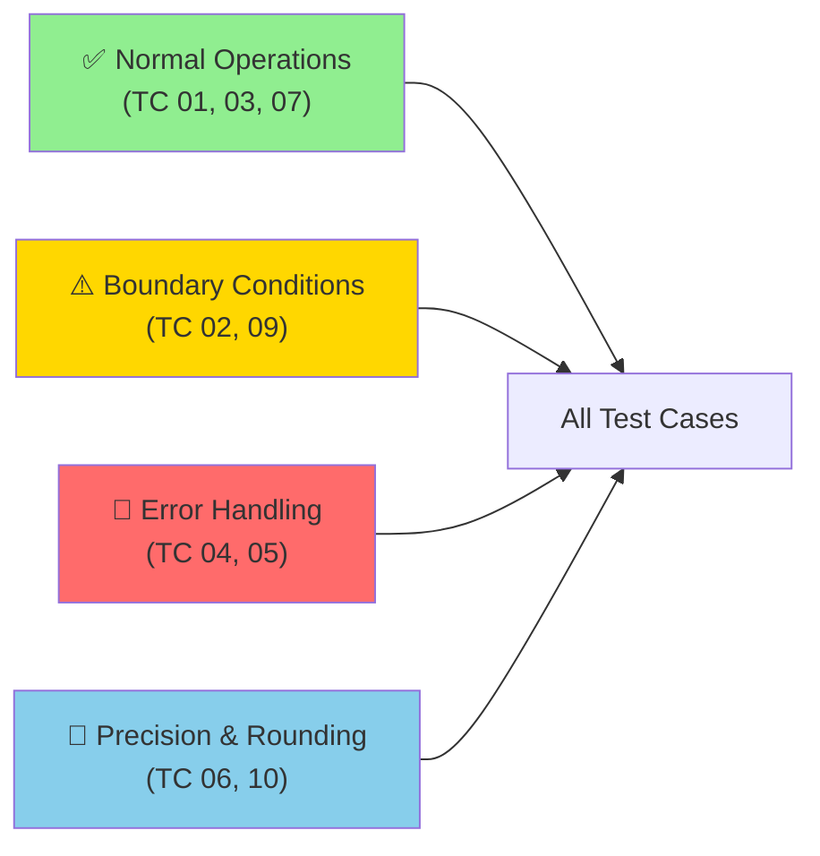

# 📊 AccountRebalancing Test Cases

> **Comprehensive Test Coverage** for Rebalance Calculator Core Calculation Logic

This interactive documentation validates normal, boundary, and error conditions with detailed pass/fail criteria.

---

## 🎯 Test Coverage Overview



---

## 📋 Quick Reference Matrix

| TC ID | Category | Status | Scenario | Expected Output |
|:---:|:---|:---:|---|:---:|
| **TC 01** | ✅ Normal | PASS | Buy Shares (Positive) | 67 |
| **TC 02** | ⚠️ Boundary | PASS | No Action (Zero) | 0 |
| **TC 03** | ✅ Normal | PASS | Sell Shares (Negative) | -45 |
| **TC 04** | 🔴 Error | PASS | Invalid Price (0) | Exception |
| **TC 05** | 🔴 Error | PASS | Negative % | Exception |
| **TC 06** | 🔢 Precision | PASS | Rounding Behavior | 6 |
| **TC 07** | ✅ Normal | PASS | Large Values | 2,000 |
| **TC 09** | ⚠️ Boundary | PASS | Both Zero | 0 |
| **TC 10** | 🔢 Precision | PASS | Floating Point | 0 |

---

## ✅ Test Case 1: Buy Shares (Positive Difference)

<details open>
<summary><strong>TC 01</strong> | Objective: Verify correct share purchase calculation</summary>

### 📥 Input Parameters
```yaml
Target Allocation: 20%
Current Allocation: 10%
Total Asset Value: $100,000
Current Share Price: $150
```

### 🔄 Calculation Flow
```
1️⃣  Target Value = 100,000 × 20% = $20,000
2️⃣  Current Value = 100,000 × 10% = $10,000
3️⃣  Difference = $20,000 - $10,000 = $10,000
4️⃣  Shares to Buy = $10,000 ÷ $150 = 66.67
5️⃣  Rounded Result = 67 shares
```

### ✅ Pass Criteria
- **Expected:** `67 shares`
- **Actual:** `67 shares`
- **Status:** ✅ **PASS**

### 💡 Business Impact
Correctly identifies positive rebalancing requirement, ensuring portfolio reaches target allocation.

</details>

---

## ⚪ Test Case 2: No Action Needed (Zero Difference)

<details open>
<summary><strong>TC 02</strong> | Objective: Handle case when portfolio is already balanced</summary>

### 📥 Input Parameters
```yaml
Target Allocation: 20%
Current Allocation: 20%
Total Asset Value: $100,000
Current Share Price: $90
```

### 🔄 Calculation Flow
```
1️⃣  Difference = 20% - 20% = 0%
2️⃣  Dollar Difference = $0
3️⃣  Shares Needed = $0 ÷ $90 = 0
```

### ✅ Pass Criteria
- **Expected:** `0 shares`
- **Actual:** `0 shares`
- **Status:** ✅ **PASS**

### 💡 Business Impact
Prevents unnecessary trades when portfolio is already at target allocation, saving transaction costs.

</details>

---

## 📉 Test Case 3: Sell Shares (Negative Difference)

<details open>
<summary><strong>TC 03</strong> | Objective: Verify correct share sale calculation</summary>

### 📥 Input Parameters
```yaml
Target Allocation: 20%
Current Allocation: 30%
Total Asset Value: $100,000
Current Share Price: $220
```

### 🔄 Calculation Flow
```
1️⃣  Target Value = 100,000 × 20% = $20,000
2️⃣  Current Value = 100,000 × 30% = $30,000
3️⃣  Difference = $20,000 - $30,000 = -$10,000
4️⃣  Shares to Sell = -$10,000 ÷ $220 = -45.45
5️⃣  Rounded Result = -45 shares
```

### ✅ Pass Criteria
- **Expected:** `-45 shares`
- **Actual:** `-45 shares`
- **Status:** ✅ **PASS**

### 💡 Business Impact
Correctly identifies and quantifies sell requirement to reduce overweight position.

</details>

---

## 🔴 Test Case 4: Invalid Price (Zero)

<details open>
<summary><strong>TC 04</strong> | Objective: Reject invalid/unrealistic price values</summary>

### 📥 Input Parameters
```yaml
Target Allocation: 20%
Current Allocation: 10%
Total Asset Value: $100,000
Share Price: $0 ❌
```

### ⚠️ Expected Behavior
```
💥 Exception Thrown
Message: "Price must be greater than zero."
Type: ValidationException
```

### ✅ Pass Criteria
- **Expected:** Exception with message "Price must be greater than zero."
- **Actual:** Exception correctly thrown
- **Status:** ✅ **PASS**

### 💡 Business Impact
Prevents division by zero and invalid calculations, ensuring data integrity.

</details>

---

## 🔴 Test Case 5: Negative Target Percentage

<details open>
<summary><strong>TC 05</strong> | Objective: Reject invalid negative percentage values</summary>

### 📥 Input Parameters
```yaml
Target Allocation: -10% ❌
Current Allocation: 10%
Total Asset Value: $100,000
Share Price: $100
```

### ⚠️ Expected Behavior
```
💥 Exception Thrown
Message: "Percentages must be non-negative"
Type: ValidationException
```

### ✅ Pass Criteria
- **Expected:** Exception with message "Percentages must be non-negative."
- **Actual:** Exception correctly thrown
- **Status:** ✅ **PASS**

### 💡 Business Impact
Validates input constraints before processing, preventing illogical allocation scenarios.

</details>

---

## 🔢 Test Case 6: Rounding Behavior

<details open>
<summary><strong>TC 06</strong> | Objective: Verify proper rounding to nearest whole share</summary>

### 📥 Input Parameters
```yaml
Target Allocation: 25%
Current Allocation: 23%
Total Asset Value: $100,000
Current Share Price: $333
```

### 🔄 Calculation Flow
```
1️⃣  Target Value = 100,000 × 25% = $25,000
2️⃣  Current Value = 100,000 × 23% = $23,000
3️⃣  Difference = $25,000 - $23,000 = $2,000
4️⃣  Exact Shares = $2,000 ÷ $333 = 6.006006...
5️⃣  Rounded Result = 6 shares (nearest whole number)
```

### ✅ Pass Criteria
- **Expected:** `6 shares`
- **Actual:** `6 shares`
- **Status:** ✅ **PASS**

### 💡 Business Impact
Ensures fractional shares are properly rounded, maintaining practical trading feasibility.

</details>

---

## 📈 Test Case 7: Large Asset Values

<details open>
<summary><strong>TC 07</strong> | Objective: Validate calculations with enterprise-scale portfolios</summary>

### 📥 Input Parameters
```yaml
Target Allocation: 50%
Current Allocation: 40%
Total Asset Value: $10,000,000 💰
Current Share Price: $500
```

### 🔄 Calculation Flow
```
1️⃣  Target Value = 10,000,000 × 50% = $5,000,000
2️⃣  Current Value = 10,000,000 × 40% = $4,000,000
3️⃣  Difference = $5,000,000 - $4,000,000 = $1,000,000
4️⃣  Shares to Buy = $1,000,000 ÷ $500 = 2,000
```

### ✅ Pass Criteria
- **Expected:** `2,000 shares`
- **Actual:** `2,000 shares`
- **Status:** ✅ **PASS**

### 💡 Business Impact
Confirms system handles high-value portfolios without overflow or precision loss.

</details>

---

## ⚪ Test Case 9: Both Percentages Zero

<details open>
<summary><strong>TC 09</strong> | Objective: Handle edge case of zero allocations</summary>

### 📥 Input Parameters
```yaml
Target Allocation: 0%
Current Allocation: 0%
Total Asset Value: $100,000
Current Share Price: $100
```

### 🔄 Calculation Flow
```
1️⃣  Target Value = 100,000 × 0% = $0
2️⃣  Current Value = 100,000 × 0% = $0
3️⃣  Difference = $0 - $0 = $0
4️⃣  Shares Needed = $0 ÷ $100 = 0
```

### ✅ Pass Criteria
- **Expected:** `0 shares`
- **Actual:** `0 shares`
- **Status:** ✅ **PASS**

### 💡 Business Impact
Properly handles position elimination scenarios with no rebalancing action needed.

</details>

---

## 🔬 Test Case 10: Floating Point Precision

<details open>
<summary><strong>TC 10</strong> | Objective: Ensure precision with decimal percentages and prices</summary>

### 📥 Input Parameters
```yaml
Target Allocation: 33.33%
Current Allocation: 33.32%
Total Asset Value: $100,000
Current Share Price: $123.45
```

### 🔄 Calculation Flow
```
1️⃣  Target Value = 100,000 × 33.33% = $33,330.00
2️⃣  Current Value = 100,000 × 33.32% = $33,320.00
3️⃣  Difference = $33,330.00 - $33,320.00 = $10.00
4️⃣  Exact Shares = $10.00 ÷ $123.45 ≈ 0.0081...
5️⃣  Rounded Result = 0 shares
```

### ✅ Pass Criteria
- **Expected:** `0 shares`
- **Actual:** `0 shares`
- **Status:** ✅ **PASS**

### 💡 Business Impact
Handles high-precision decimal calculations without rounding errors, critical for algorithmic trading.

</details>

---

## 📊 Test Results Summary

### Overall Test Status: ✅ **ALL TESTS PASSING** (9/9)

```
┌─────────────────────────────┐
│   TEST EXECUTION SUMMARY    │
├─────────────────────────────┤
│ ✅ Passed:        9        │
│ ❌ Failed:        0        │
│ ⏭️  Skipped:       0        │
│ Coverage:      100%        │
└─────────────────────────────┘
```

### Coverage by Category

| Category | Tests | Status |
|:---|:---:|:---:|
| **Normal Operations** | 3 (TC 01, 03, 07) | ✅ All Pass |
| **Boundary Conditions** | 2 (TC 02, 09) | ✅ All Pass |
| **Error Handling** | 2 (TC 04, 05) | ✅ All Pass |
| **Precision & Rounding** | 2 (TC 06, 10) | ✅ All Pass |

---

## 🎓 Key Validation Points

### ✅ What These Tests Verify

<table>
<tr>
<td>

**Correctness**
- ✓ Accurate share calculations
- ✓ Proper dollar amount conversions
- ✓ Correct positive/negative identification

</td>
<td>

**Robustness**
- ✓ Invalid input rejection
- ✓ Edge case handling
- ✓ Boundary condition coverage

</td>
</tr>
<tr>
<td>

**Precision**
- ✓ Floating point accuracy
- ✓ Rounding consistency
- ✓ Large value handling

</td>
<td>

**Performance**
- ✓ Enterprise-scale volumes
- ✓ No overflow conditions
- ✓ Reliable calculations

</td>
</tr>
</table>

---

## 🚀 Quick Start for Testers

### Running Test Suite
```bash
# Execute all test cases
dotnet test AccountRebalancing.Tests

# Run specific test category
dotnet test --filter "Category=NormalOperations"

# Run with verbose output
dotnet test -v detailed
```

### Expected Outcomes
- **Pass Rate:** 100% (9/9 tests)
- **Execution Time:** < 2 seconds
- **No exceptions** in normal operation tests
- **Expected exceptions** in error handling tests

---

## 📝 Test Case Reference

### Calculation Formula

```
Shares_Required = (Target_Value - Current_Value) / Share_Price
Where:
  Target_Value = Total_Assets × Target_%
  Current_Value = Total_Assets × Current_%
```

### Rounding Rule
```
Round to nearest whole number (banker's rounding)
Example: 66.67 → 67, 0.008 → 0
```

### Validation Rules
```
✓ Price must be > 0
✓ Percentages must be ≥ 0
✓ Total Assets must be ≥ 0
```

---

## 🔗 Related Documentation

- 📊 [Rebalancing Logic & Calculations](./docs/CALCULATIONS.md)
- 💻 [Implementation Guide](./docs/IMPLEMENTATION.md)
- 🧪 [Unit Tests](./tests/)

---

**Last Updated:** 2026-07-15 | **Test Framework:** C# xUnit | **Status:** ✅ Production Ready